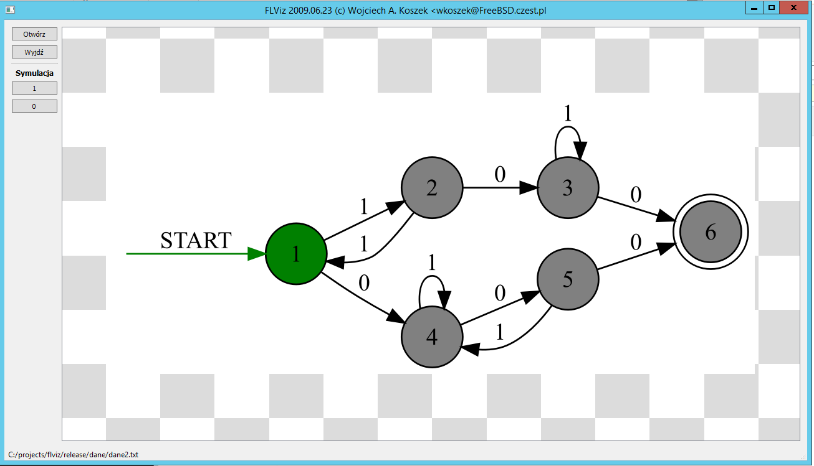

FLVIZ - DFA simulator
=============================================================

FLVIZ stands for "Formal Languages Visualizer". It is a Windows GUI program
which reads a configuration file, and based on its content creates a
visualization of a state machine (graph), and lets you apply a stimulus
(vocabulary) and see the state transitions happen dynamically.

# Introduction

It was originally written in 2009 during my "Formal Languages" class which
was a part of my M.Sc CS curriculum.  The biggest challenge was getting it on
time and making it work under Windows, since it was written in about 3 days
on FreeBSD and then quickly ported. You can see what I mean if you glance at
the `release` directory.

Created for Windows XP with SP 3 and based on QT Creator and `QT4`
library, it hasn't been build/used since I finished the class. In 2015 I
have updated it: by using http://www.appveyor.com I converted it to `Qt5`
library and made it work on Windows Server 2012.

During "Formal languages" class we were provided the state machine
input file. The format isn't something I designed and is very imperfect.

# Requirements

- Windows system. Originally XP, then ported to Windows Server 2012. I
suspect any decent Windows version should be fine.
- Qt Creator (tested with Qt 5.5)
- MinGW GCC (installation as a part of Qt)
  - I haven't tested building it with Microsoft Visual C++

All libraries are present in the repo, so deployment straight after
compilation should be possible.

# Build instructions

For convenience, build script `build.bat` is present in the repository. To
build, run:

	build.bat

Please note this script may need to be adjusted if you end up building with
anything else but Qt 5.5.

# Convenience tools for AppVeyor

If you clone the repository and also decide to use Appveyor for remote
testing/work, you may want to run:

	gettools.bat

Which will install both Vim editor and ConEmu, which are convenience tools
for development.

# Data format

Data format was provided in a class. It's not great. Sample data format is
as follows:

	 filename   line             data
	---------------------------------------------------------
	data.1.txt |  1 |		5 3 2
	data.1.txt |  2 |
	data.1.txt |  3 |		<tablica wejsciowa ASD>
	data.1.txt |  4 |		0 1 e
	data.1.txt |  5 |		1 f f 2
	data.1.txt |  6 |		2 3 f f
	data.1.txt |  7 |		3 f f 2
	data.1.txt |  8 |		4 f 5 f
	data.1.txt |  9 |		5 f f f
	data.1.txt | 10 |
	data.1.txt | 11 |		<tablica stanow koncowych>
	data.1.txt | 12 |		3 4

Empty spaces or lines don't matter. For convenience of discussion, I'm
mentioning line numbers for reference below. `f` means empty state.

TODO: understand state indexing. My original comment stated states are
indexed from 0, which I believe referred to the implementation.

## Data format explanation

* Line (1), intro:
   - 5 states
   - 3 letters in the alphabet
   - 2 end states

* Line (3), magic pragmas:
   - `<tablica wejsciowa ASD>` dla automatu ASD
   - `<tablica wejsciowa ASN>` dla automatu ASN
   - **TODO**: I don't remember what these were all about.

* Line (4):
   - Alphabet available to this program

* Lines (5--9):
   - first column means state name, if I'm not mistaken
   - consecutive columns define transitions if one of the alphabet inputs is
     applied.
   - **TODO**: example needed. Must confirm.

* Line (11), magic pragma:
   - List of end states.
